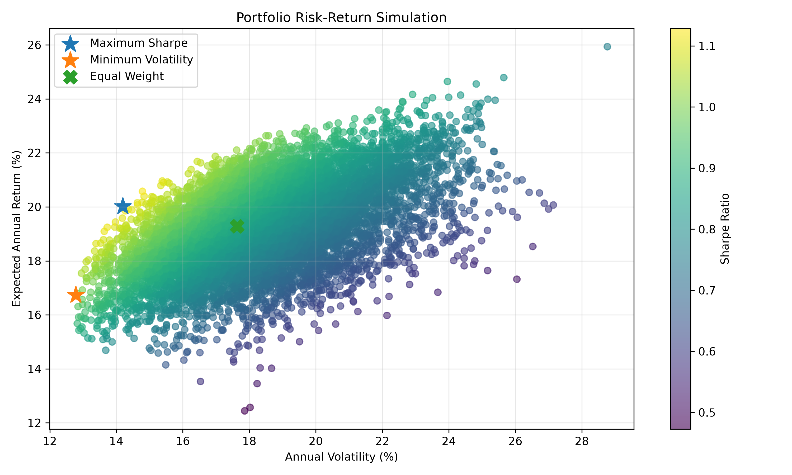
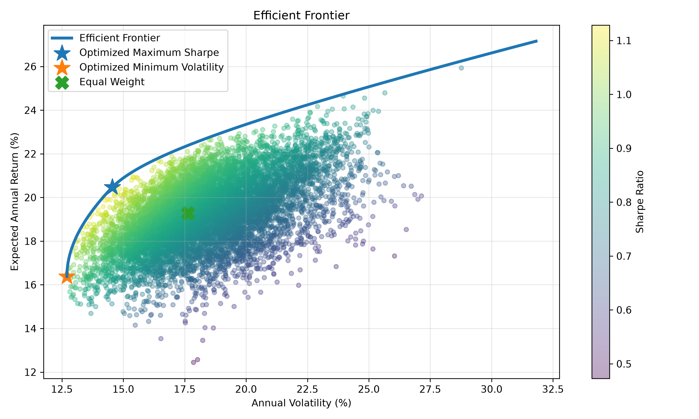
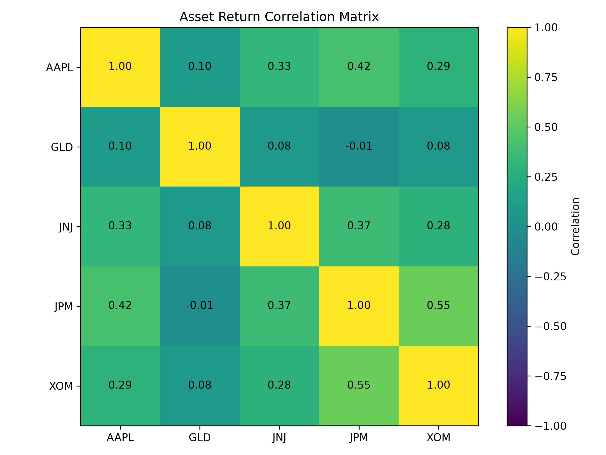

# Portfolio Optimization & Efficient Frontier Analysis

## Overview

This project applies modern portfolio theory to analyze and optimize a portfolio of five assets across different sectors and asset classes:

- AAPL — Apple
- JPM — JPMorgan Chase
- XOM — Exxon Mobil
- JNJ — Johnson & Johnson
- GLD — SPDR Gold Shares

Using historical adjusted closing prices from 2020 to 2025, the project evaluates the risk-return characteristics of the assets and constructs optimized portfolios using Monte Carlo simulation and mathematical optimization.

The analysis focuses on:

- Expected annual returns
- Annualized volatility
- Covariance and correlation
- Portfolio diversification
- Sharpe ratio
- Monte Carlo portfolio simulation
- Maximum Sharpe portfolio
- Minimum volatility portfolio
- Efficient frontier


## Tools & Libraries

- Python
- pandas
- NumPy
- yfinance
- Matplotlib
- SciPy


## Methodology

### 1. Historical Price Data

Adjusted closing prices were downloaded using `yfinance` for:

- AAPL
- GLD
- JNJ
- JPM
- XOM

The analysis covers January 2020 through December 2025.


### 2. Daily Returns

Daily percentage returns were calculated using:

$$
R_t = \frac{P_t}{P_{t-1}} - 1
$$


### 3. Expected Annual Returns

Historical mean daily returns were annualized using approximately 252 trading days:

$$
E(R_{annual}) = E(R_{daily}) \times 252
$$


### 4. Annualized Volatility

Daily return standard deviation was annualized using:

$$
\sigma_{annual} = \sigma_{daily}\sqrt{252}
$$


### 5. Portfolio Risk

Portfolio variance was calculated using the covariance matrix:

$$
\sigma_p^2 = w^T \Sigma w
$$

Portfolio volatility is therefore:

$$
\sigma_p = \sqrt{w^T \Sigma w}
$$


### 6. Sharpe Ratio

A 4% annual risk-free rate was assumed.

$$
\text{Sharpe Ratio} =
\frac{R_p - R_f}{\sigma_p}
$$


## Individual Asset Results

| Asset | Expected Annual Return | Annualized Volatility |
|---|---:|---:|
| AAPL | 27.16% | 31.81% |
| GLD | 18.28% | 16.34% |
| JNJ | 10.59% | 19.65% |
| JPM | 21.49% | 31.38% |
| XOM | 18.89% | 32.81% |


## Monte Carlo Simulation

10,000 random long-only portfolios were generated.

For every portfolio:

1. Random asset weights were generated.
2. Weights were normalized to sum to 100%.
3. Expected portfolio return was calculated.
4. Portfolio volatility was calculated.
5. Sharpe ratio was calculated.

The simulation provides a visual representation of the feasible risk-return region.




## Mathematical Portfolio Optimization

SciPy's SLSQP optimizer was used to calculate portfolio allocations subject to:

\[
\sum w_i = 1
\]

and:

\[
0 \leq w_i \leq 1
\]

Short selling was therefore not allowed.


## Portfolio Comparison

| Portfolio | Expected Return | Volatility | Sharpe Ratio |
|---|---:|---:|---:|
| Equal Weight | 19.28% | 17.63% | 0.87 |
| Maximum Sharpe | 20.47% | 14.55% | 1.13 |
| Minimum Volatility | 16.38% | 12.70% | 0.97 |


## Maximum Sharpe Portfolio

The optimized maximum-Sharpe portfolio produced:

- Expected annual return: **20.47%**
- Annualized volatility: **14.55%**
- Sharpe ratio: **1.13**

Allocation:

| Asset | Weight |
|---|---:|
| AAPL | 19.75% |
| GLD | 64.47% |
| JNJ | 0.00% |
| JPM | 13.05% |
| XOM | 2.72% |


## Minimum Volatility Portfolio

The optimized minimum-volatility portfolio produced:

- Expected annual return: **16.38%**
- Annualized volatility: **12.70%**
- Sharpe ratio: **0.97**

Allocation:

| Asset | Weight |
|---|---:|
| AAPL | 3.12% |
| GLD | 56.24% |
| JNJ | 31.15% |
| JPM | 6.27% |
| XOM | 3.22% |


## Efficient Frontier

The efficient frontier represents portfolios that achieve the minimum possible volatility for a given level of expected return.

The maximum-Sharpe and minimum-volatility portfolios both lie on the calculated efficient frontier.




## Correlation Analysis

Correlation analysis was used to examine diversification opportunities between the assets.



GLD showed particularly low correlation with the equity assets:

| Pair | Correlation |
|---|---:|
| GLD / AAPL | 0.10 |
| GLD / JNJ | 0.08 |
| GLD / JPM | -0.01 |
| GLD / XOM | 0.08 |

In comparison, JPM and XOM had a correlation of **0.55**, the highest cross-asset correlation in the portfolio.

GLD's low correlations, combined with its relatively low historical volatility, help explain its large allocation in both optimized portfolios.


## Key Findings

The optimized maximum-Sharpe portfolio improved the historical risk-return profile compared with equal weighting.

The equal-weight portfolio generated an estimated annual return of 19.28% with 17.63% volatility and a Sharpe ratio of 0.87.

The optimized maximum-Sharpe portfolio increased estimated return to 20.47% while reducing volatility to 14.55%, increasing the Sharpe ratio to 1.13.

The analysis also demonstrates the importance of diversification. GLD received substantial weights in both optimized portfolios because its historical returns exhibited relatively low correlation with the selected equities.

The minimum-volatility portfolio allocated more than 31% to JNJ, while the maximum-Sharpe portfolio allocated 0% to JNJ. This demonstrates how portfolio allocations change depending on whether the objective is minimizing total risk or maximizing risk-adjusted return.


## Limitations

The optimization relies on historical returns and covariance relationships from 2020–2025.

Historical performance does not guarantee future performance, and portfolio optimization can be highly sensitive to estimated expected returns.

The analysis also assumes:

- A constant 4% risk-free rate
- No short selling
- No transaction costs
- No taxes
- Full investment of portfolio capital
- Historical relationships are useful estimates of future risk and return

The resulting allocations should therefore be interpreted as outputs of the historical model rather than investment recommendations.


## Project Structure

```text
portfolio-optimization/
│
├── portfolio_optimization.py
├── README.md
├── requirements.txt
├── .gitignore
│
├── data/
│   └── portfolio_comparison.csv
│
└── charts/
    ├── portfolio_simulation.png
    ├── efficient_frontier.png
    └── correlation_matrix.png